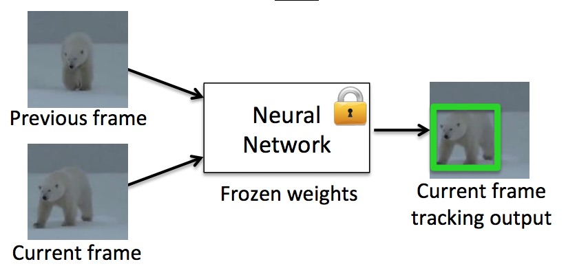

# L1 - 06: 2D Object Tracking with OpenCV and Deep Learning

## Overview

This is a set of Object Tracking projects using OpenCV and deep learning frameworks such as tensorflow, pytorch, caffe, ...

## Object Tracking Pipeline (OpenCV) 

1. BOOSTING
2. MIL 
3. KCF 
4. CRST
5. TLD: Tends to recover from occulusions
6. MEDIANFLOW: Good for predictable slow motion
7. **GOTURN**: deep learning-based
- Most Accurate 
8. MOSSE
- Fastest

## Contributing

If you want to contribute to this project, you are welcome to do so. You can either add new projects, improve existing ones, or fix bugs and errors. 

Please follow these steps to contribute:

- Fork this repository and clone it to your local machine.
- Create a new branch with a descriptive name for your contribution.
- Add your code and files to the branch and commit your changes.
- Push your branch to your forked repository and create a pull request to the main repository.
- Wait for your pull request to be reviewed and merged.

## References

- [Caffe DNN pre-trained model and defaults parameters](https://github.com/opencv/opencv/tree/4.x/samples/dnn)

