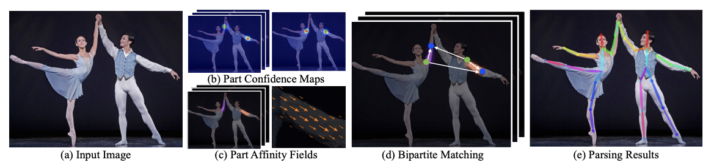

# L1 - 07: Human Pose Estimation using Deep Learning

## Overview

Human Pose Estimation using Deep Learning.

## Contributing

If you want to contribute to this project, you are welcome to do so. You can either add new projects, improve existing ones, or fix bugs and errors. 

Please follow these steps to contribute:

- Fork this repository and clone it to your local machine.
- Create a new branch with a descriptive name for your contribution.
- Add your code and files to the branch and commit your changes.
- Push your branch to your forked repository and create a pull request to the main repository.
- Wait for your pull request to be reviewed and merged.

## References

papers:
- [2D-3D Pose Estimation papers](./docs/)
