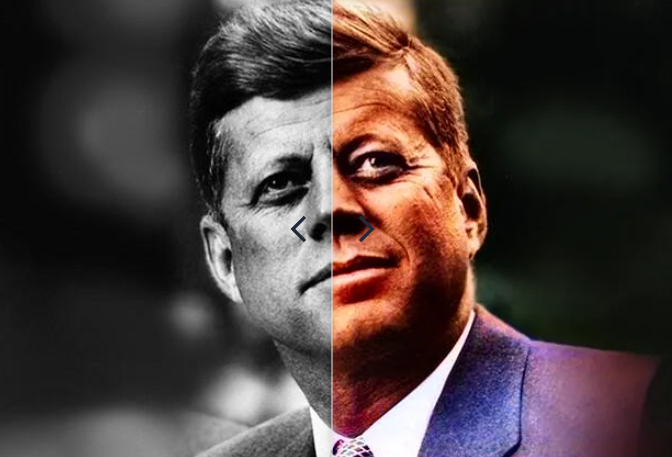

# L2 - 03: AI Powered Image Restoration and Enhancement

## Overview

Collection of AI Image Restoration and Enhancement Tasks.

### Tasks

|Name|Description| Notebooks|
|--|--|--|
|[T1 - Image Resolution](#)|Increase image resolution||
|[T2 - De-noising](#)|Remove noise||
|[T3 - De-blurring](#)|Sharpen blurry images||
|[T4 - Image Colorization](#)|Add color information to grayscale images||
|[T5 - Image Inpainting](#)| Reconstruct missing or damaged parts of an image||

**Implementation Pipeline**

- Setup Environment
- Install Dependencies
- Load Pre-trained Models
- Process Images for Each Task
- Visualization

## Contributing

If you want to contribute to this project, you are welcome to do so. You can either add new projects, improve existing ones, or fix bugs and errors. 

Please follow these steps to contribute:

- Fork this repository and clone it to your local machine.
- Create a new branch with a descriptive name for your contribution.
- Add your code and files to the branch and commit your changes.
- Push your branch to your forked repository and create a pull request to the main repository.
- Wait for your pull request to be reviewed and merged.

## References
- [Image restoration by artificial intelligence - Wikipedia](https://en.wikipedia.org/wiki/Image_restoration_by_artificial_intelligence)
- [Generative AI Restores Imperfect Photos to Perfection - Cloudinary](https://cloudinary.com/blog/generative-ai-restores-imperfect-photos)
- [Enhance Image Quality with AI: A Step-by-Step Guide - Toolify.ai](https://www.toolify.ai/ai-news/enhance-image-quality-with-ai-a-stepbystep-guide-1151014)

