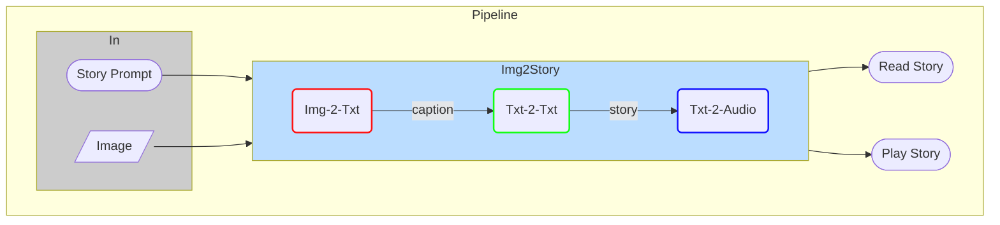

# L2-05: AI Image Captioning and Storytelling

## Overview

Generate textual and audio stories from image.

## Storyteller Pipeline

### Description

| Module | Description |
|---|---|
| **Img-2-Txt** | Generates caption for image |
| **Txt-2-Txt** | Creates cool stories from image caption |
| **Txt-2-Audio** | Converts textual story to audio |

## Contributing

If you want to contribute to this project, you are welcome to do so. You can either add new projects, improve existing ones, or fix bugs and errors. 

Please follow these steps to contribute:

- Fork this repository and clone it to your local machine.
- Create a new branch with a descriptive name for your contribution.
- Add your code and files to the branch and commit your changes.
- Push your branch to your forked repository and create a pull request to the main repository.
- Wait for your pull request to be reviewed and merged.

## References

- [Image-Based Storytelling Using Deep Learning - ICCCV 2022 - ACM](https://cerv.aut.ac.nz/wp-content/uploads/2022/05/ICCCV_Yulin-Zhu_27032022.pdf)
- [Deep Learning-Based Short Story Generation for an Image Using the Encoder-Decoder Structure - 2021](https://ieeexplore.ieee.org/stamp/stamp.jsp?arnumber=9512087)
- [Vision Meets Language: AI-Powered Storytelling from Images](https://www.alamedadev.com/insight/ai-image-storytelling-tutorial)

