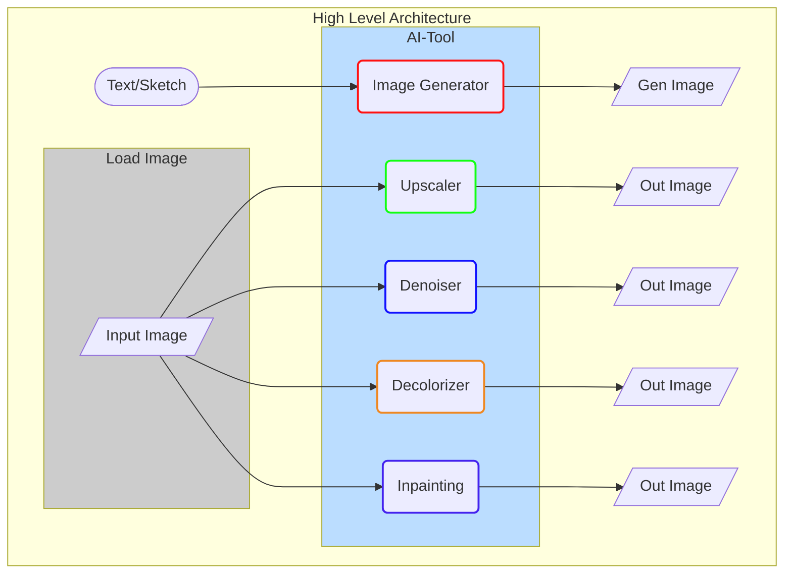

# L2-06: AI Assisted Image Editing and Manipulation	

## Overview

This is an AI Image Editing and Manipulation tool for Image creation, editing and manipulation.

**Tasks:**
- Creation: Generate AI Image with text prompt or with a sketch
- Editing: using sketch, inpainting with diffusion mode
- Manipulation: upscale, denoise, colorize and deblur 

## Pipeline

## Contributing

If you want to contribute to this project, you are welcome to do so. You can either add new projects, improve existing ones, or fix bugs and errors. 

Please follow these steps to contribute:

- Fork this repository and clone it to your local machine.
- Create a new branch with a descriptive name for your contribution.
- Add your code and files to the branch and commit your changes.
- Push your branch to your forked repository and create a pull request to the main repository.
- Wait for your pull request to be reviewed and merged.

## References
- [Rethinking Image Editing Detection in the Era of Generative AI Revolution - 2023](https://arxiv.org/pdf/2311.17953.pdf)
- [LEDITS: Real Image Editing with DDPM Inversion and Semantic Guidance](https://huggingface.co/spaces/editing-images/project)
- [Image-Editing Basics and a Tutorial for Automation With AI - Cloudinary](https://cloudinary.com/blog/image_editing_basics_and_a_tutorial_for_automation_with_ai)
- [Revolutionizing Image Editing: How AI is Transforming Photo Retouching](https://topdigital.agency/revolutionizing-image-editing-how-ai-is-transforming-photo-retouching/)
- [Build Free AI Sketch2Picture Tool using Stable Diffusion & Gradio](https://www.youtube.com/watch?v=TOk75Xcjolg)

**Benchmark projects:**
- [freepikAI](https://www.freepik.com/ai)
- [Magnific](https://magnific.ai/)
- [Cloudinary.com](https://cloudinary.com)
  - [Image-Editing Basics and a Tutorial for Automation With AI - cloudinary.com](https://cloudinary.com/blog/image_editing_basics_and_a_tutorial_for_automation_with_ai)
- [AI Photoshop - Etrans Lab: Image inpainting tool](https://console.cloud.google.com/marketplace/product/etranslab-public/ai-photoshop?hl=fr&project=ace-forest-432206-b8)
  - Demo: [ai-photoshop.mp4 - s3.amazonaws.com](https://s3.amazonaws.com/ami.initialization/LamaCleaner/ai-photoshop.mp4)
 
