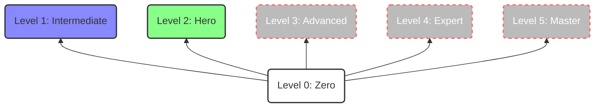

   

# Computer Vision Challenge 🏆 

## Overview

This is a collection of foundational projects for anyone diving into computer vision. 

Explore some of computer vision core concepts and hands-on projects through this fun challenge.

The project has 3 levels: 
- **Level 0 - Zero (beginner): Getting Started with Basics** 
- **Level 1 - Apprentice (intermediate): Hands-on Computer Vision with Deep Learning**
- **Level 2 - Hero (advanced): Large Vision Models (LVMs) from Image Generation, Inpainting, & More** 

> [!IMPORTANT]\
> In L1 and L2, we primarily leverage pre-trained models to ensure accessibility for everyone. This also allows us to explore a wider range of vision recognition tasks using different types of models while focusing on the model's performance and outcome.

## Basic Computer Vision Pipeline


## Requirements

To install the dependency packages using either `conda` or `pip`:

**Using conda**:

1. create a new conda environment

```bash
conda create --name cv-challenge
```

2. Activate the newly created environment:

```
source activate cv-challenge  # For bash/zsh
conda activate cv-challenge  # For conda prompt/powershell
```

3. Install dependencies from the requirements.txt file:


```bash
conda install --channel conda-forge --file requirements.txt
```

**Using pip**:

1. Install dependencies from the requirements.txt file:

```bash
pip install -r requirements.txt
```

## Hands-on Computer Vision Challenges!

### Level 0 - Zero: Getting Started with Basics 💪

||Project|Description|Notebooks|
|--|--|--|--|
|[[1]](./L0_01_Getting_Started_With_Images)| Getting Started with Images| Load an image, display it, and apply basic transformations.|[](https://colab.research.google.com/github/afondiel/computer-vision-hello-world-challenges/blob/main/L0_01_Getting_Started_With_Images/Getting_Started_with_Images.ipynb)|
|[[2]](./L0_02_Basic_Image_Manipulation)| Basic Image Manipulation| Modify pixels, resizing, Flipping, Cropping, image annotations|[](https://colab.research.google.com/github/afondiel/computer-vision-hello-world-challenges/blob/main/L0_02_Basic_Image_Manipulation/Basic_Image_Manipulations_Crop_Resize_Flip_and_Modify_Pixels.ipynb)|
|[[3]](./L0_03_Image_Filtering_in_OpenCV)| Image Filtering & Restoration|	Enhance or manipulate image features using filtering techniques.|[](#)|
|[[4]](./L0_04_Basic_Image_Enhancement_Using_Bitwise/)| Image Enhancement | Enhance using arithmetic & bitwise operations|[](https://colab.research.google.com/github/afondiel/computer-vision-hello-world-challenges/blob/main/04_Zero_Basic_Image_Enhancement_Using_Bitwise/Bitwise_Operations_on_images.ipynb)|
|[[5]](./L0_05_Image_Segmentation_Traditional_CV/)| Image Segmentation (Traditional)| segment images into regions or pixels that belong to different classes or categories|[](#)|
|[[6]](./L0_06_Feature_Extraction_Alignment/)| Feature Extraction & Alignment| Learn how to extract features from images using descriptors based on the nature of the features|[](https://colab.research.google.com/github/afondiel/computer-vision-hello-world-challenges/blob/main/L0_06_Feature_Extraction_Alignment/Image_Features_and_Image_Alignment.ipynb)|
|[[7]](./L0_07_Optical_Character_Recognition_OCR/)| Optical Character Recognition (OCR)| Learn how to recognize text in images or documents using libraries such as Tesseract, Pytesseract, or EasyOCR|[](https://colab.research.google.com/github/afondiel/computer-vision-challenge/blob/main/L0_07_Optical_Character_Recognition_OCR/notebooks/OCR_Pytesseract.ipynb)|

### Level 1 - Apprentice: Hands-on Computer Vision with Deep Learning 🔥

||Project|Description|Notebooks|
|--|--|--|--|
|[[1]](./L1_01_MNIST_Handwritten_Digit_Recognition)|MNIST Handwritten Digit Recognition	|Train a simple neural network to classify handwritten digits from the MNIST dataset.|[](https://colab.research.google.com/github/afondiel/computer-vision-challenge/blob/main/L1_02_MNIST_Handwritten_Digit_Recognition/notebooks/MNIST_Image_Recognition.ipynb)|
|[[2]](./L1_02_CIFAR_10_Image_Classification)|CIFAR-10 Image Classification	|Utilize convolutional neural networks (CNNs) to classify images of different types of objects from the CIFAR-10 dataset.|[](https://colab.research.google.com/github/afondiel/computer-vision-challenge/blob/main/L1_02_CIFAR_10_Image_Classification/notebooks/CIFAR_10_Image_Classification.ipynb)|
|[[3]](./L1_03_Object_Detection_with_YOLOv_)|Object Detection with YOLOv5	|Implement YOLOv5, a real-time object detection algorithm, to detect objects in images and videos.|[](https://colab.research.google.com/github/afondiel/computer-vision-challenge/blob/main/L1_03_Object_Detection_with_YOLOv_/notebooks/Object_Detection_with_YOLOv5.ipynb)|
|[[4]](./L1_04_Image_Segmentation_with_Deep_Learning)|Semantic Segmentation with DeepLabv3+	|Utilize DeepLabv3+, a semantic segmentation model, to segment images into different semantic categories.|[](https://colab.research.google.com/github/afondiel/computer-vision-hello-world-challenges/blob/main/L1_04_Image_Segmentation_with_Deep_Learning/notebooks/road-segmentation-fcn-tf.ipynb)|
|[[5]](./L1_05_Face_Detection_with_Deep_Learning)|Facial Recognition with OpenFace	|Explore facial recognition using OpenFace, a facial recognition library, to identify individuals in images.|[](https://colab.research.google.com/github/afondiel/computer-vision-hello-world-challenges/blob/main/L1_05_Face_Detection_with_Deep_Learning/notebooks/Face_Detection_with_Caffe.ipynb)|
|[[6]](./L1_06_2D_Object_Tracking)| Object Tracking|	Follow the movement of objects in a video sequence.|[](https://colab.research.google.com/github/afondiel/computer-vision-hello-world-challenges/blob/main/L1_06_2D_Object_Tracking/notebooks/object-tracking-deep-sort.ipynb)|
|[[7]](./L1_07_Human_Pose_Estimation_with_Deep_Learning) | Human Pose Estimation | Estimate the pose of a person in an image or a video using OpenCV and a pre-trained model. |[](https://colab.research.google.com/github/afondiel/computer-vision-hello-world-challenges/blob/main/L1_07_Human_Pose_Estimation_with_Deep_Learning/Human_Pose_Estimation_using_Deep_Learning.ipynb)|


### Level 2 - Hero: Large Vision Models (LVMs) from Image Generation, Inpainting, & More ⚡

||Project|Description|Notebooks|
|--|--|--|--|
|[[1]](L2_01_Creative_Image_Generation_with_GANs)|Creative Image Generation with GANs	|Generate novel images of different styles using GANs.|[](https://colab.research.google.com/github/afondiel/computer-vision-challenge/blob/main/L2_01_Creative_Image_Generation_with_GANs/notebooks/Image_Generation_GANs.ipynb)|
|[[2]](L2_02_Text_to_Image_Synthesis_with_LLMs_and_Large_Vision_Models)|Text-to-Image Synthesis with LLMs and Diffusion Models	|Create realistic and creative images from text descriptions using LLMs and diffusion models.|[](https://colab.research.google.com/github/afondiel/computer-vision-challenge/blob/main/L2_02_Text_to_Image_Synthesis_with_LLMs_and_Large_Vision_Models/notebooks/Text_to_Image_Synthesis_LLMs_VLMs.ipynb)|
|[[3]](L2_03_AI_Powered_Image_Restoration_and_Enhancement)|AI-Powered Image Restoration and Enhancement	|Restore and enhance images using AI methods.|[](https://colab.research.google.com/github/afondiel/computer-vision-challenge/blob/main/L2_03_AI_Powered_Image_Restoration_and_Enhancement/notebooks/AI_Image_Restoration_Enhancement_T1_Image_Resolution.ipynb)|
|[[4]](L2_04_Style_Transfer_with_GANs_and_Image_Processing)|Style Transfer with GANs and Image Processing	|Transfer the artistic style of one image to another.|[](./L2_04_Style_Transfer_with_GANs_and_Image_Processing/notebooks/style_transfer_tf.ipynb)|
|[[5]](L2_05_AI_Driven_Image_Captioning_and_Storytelling)|AI-Driven Image Captioning and Storytelling |Generate comprehensive and creative captions and stories from images using LLMs.|[](https://colab.research.google.com/github/afondiel/computer-vision-challenge/blob/main/L2_05_AI_Driven_Image_Captioning_and_Storytelling/notebooks/AI_Image_Captioner_Storyteller.ipynb)|
|[[6]](L2_06_AI_Assisted_Image_Editing_and_Manipulation)|AI-Assisted Image Editing and Manipulation	|Automate image editing and manipulation tasks using AI.|[](https://github.com/afondiel/computer-vision-challenge/tree/main/L2_06_AI_Assisted_Image_Editing_and_Manipulation)|
|[[7]](L2_07_AI_Image_Recognition_Benchmarking_SOTA_Vision_Models)|AI Image Recognition Benchmarks with SOTA Vision Models| Benchmark SOTA Vision Models on a variety of image recognition tasks, including image classification, object detection, ...|[](https://colab.research.google.com/github/afondiel/computer-vision-challenge/blob/main/L2_07_AI_Image_Recognition_Benchmarking_SOTA_Vision_Models/notebooks/AI_Image_Recognition_Benchmarks_SOTA_Vision_Models.ipynb)|

## Usage

Most projects are written in Jupyter notebooks, you can run the directly using `jupyter notebook/lab` or `Colab`.

For projects with a `main.py` file, run the command below:
  
```
python main.py
```

## Roadmap & Upcoming Features

**Roadmap:**


New levels:
- L3 - Advanced: Video Models Benchmarking
- L4 - Expert: Finetuning of VLMs (Vision Language Models) & LVMs
- L5 - Master: Multimodality


**Upcoming Features:**

| Feature | Description | Status |
|---|---|---|
| **Code Refactoring** | Enhance code readability by cleaning, documenting, and integrating Gradio demos. | To-Do |
| **New Learning Levels** | Introduce advanced levels: L3 - Video Models Benchmarking, L4 - Finetuning of VLMs (Vision Language Models) & LVMs, and L5 - Multimodality | To-Do |
| **Wiki Update** | Document the new learning levels in the project Wiki. | To-Do |
| **Multilingual Support** | Translate the README.md file into multiple languages (French, Spanish, etc.). | To-Do |
| **Edge Device Deployment** | Explore code translation for deployment on edge devices using C++ or Rust. | To-Do |
| **Performance Enhancements** | Investigate options to improve performance, including adding new datasets and supporting additional computer vision tasks. | To-Do |
| **Machine Learning Framework Integration** | Integrate the project with popular machine learning frameworks. | To-Do |


## Contributing

We warmly welcome your contributions! Whether you're a seasoned developer or just starting out in Computer Vision, you can help us improve the project and make it more valuable to everyone.

How to contribute:

- Fork this repository and clone it to your local machine.
- Create a new branch with a descriptive name for your contribution.
- Add your code and files to the branch and commit your changes.
- Push your branch to your forked repository and create a pull request to the main repository.
- Wait for your pull request to be reviewed and merged.

## Sponsor this Project

Another way to get involved is by [sponsoring](https://github.com/sponsors/afondiel) the project.

Your support will help:

- Provide computational resources (This is a GPU Poor Project!!!) to explore new frontiers in computer vision by training larger and more complex model
- Keep the project up to date with the latest computer vision advancements
- Create more detailed tutorials for users at all skill levels 


## LICENSE

This project is licensed under the MIT [LICENSE](./LICENSE).

## References

The following resources have been influential in shaping this project:

- [Computer Vision OpenCV Python Free Course Udemy](https://github.com/afondiel/Computer-Vision-OpenCV-Python-Free-Course-Udemy)
- [Computer Vision Free Course - Kaggle](https://github.com/afondiel/Computer-Vision-Kaggle-Free-Course)
- [Visual Perception for Self-Driving Cars - University of Toronto](https://github.com/afondiel/Self-Driving-Cars-Specialization/tree/main/Course3-Visual-Perception-for-Self-Driving-Cars)
- [The Complete Self-Driving Car Course - Udemy](https://github.com/afondiel/The-Complete-Self-Driving-Car-Course-Udemy)
- [Top Computer Vision Projects (2023) - GeeksforGeeks](https://www.geeksforgeeks.org/computer-vision-projects/)
- [15 Computer Visions Projects You Can Do Right Now - neptune.ai](https://neptune.ai/blog/15-computer-visions-projects)
- [30+ Unique Computer Vision Projects with Source Code – 2023](https://machinelearningprojects.net/opencv-projects/)
- [7+ Computer Vision Projects on GitHub with Source Code 2024 - Omdena](https://omdena.com/blog/computer-vision-projects-github/)
- [20+ Computer Vision Projects Ideas for Beginners in 2023](https://www.projectpro.io/article/computer-vision-projects/437).
-  [A Dive into Vision-Language Models](https://huggingface.co/blog/vision_language_pretraining)
-  [Advances in Visual Pretraining for LLMS | Neil Houlsby](https://www.youtube.com/watch?v=ZwtMEF0u5cM)
-  [VisionLLM: Large Language Model is also an Open-Ended Decoder for Vision-Centric Tasks](https://arxiv.org/pdf/2305.11175.pdf)
-  [LLMs as Visual Explainers: Advancing Image Classification with Evolving Visual Descriptions](https://arxiv.org/pdf/2311.11904.pdf)
-  [Transforming Computer Vision with LLMs - Data Science Dojo](https://datasciencedojo.com/tutorial/transforming-computer-vision-with-llms/)

> ### "Vision is a picture of the future that produces passion." - Bill Hybels


